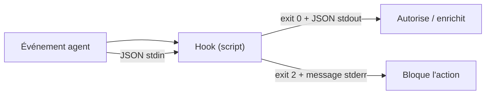

# 105 — Hooks — automatismes événementiels

**Durée** : 30 min · **Complexité** : ⭐⭐ · **Pré-requis** : [Module 103 — Skills](./103-skills.md)

> Un *skill* se déclenche quand tu le demandes. Un *hook* se déclenche quand un *événement de l'agent* se produit — sans que tu aies à y penser.

:::info Fonctionnalité en préversion
Les hooks sont une fonctionnalité **Preview** de VS Code. Le schéma de configuration peut encore évoluer ; vérifie la [documentation officielle](https://code.visualstudio.com/docs/agent-customization/hooks) avant de t'appuyer dessus en production.
:::

## Pourquoi ce module

Tu sais créer des skills qui s'activent conditionnellement. Mais certaines règles doivent s'appliquer *systématiquement* — avant chaque appel d'outil, après chaque édition de fichier, au démarrage de chaque session — sans que tu aies besoin de le demander dans le *chat*.

Un `hook` résout ce problème. C'est un **script externe** que l'agent Copilot exécute automatiquement en réponse à un *événement de l'agent*. Le script reçoit le contexte de l'événement en JSON sur son entrée standard et peut, en retour, **autoriser, bloquer ou enrichir** l'action de l'agent. À la fin de ce module, tu sais :

- expliquer ce qu'est un hook et en quoi il diffère d'un `skill` et d'une instruction ;
- déclarer un hook dans un fichier JSON et reconnaître les huit événements disponibles ;
- choisir entre un hook **machine** (`~/.copilot/hooks/`) et un hook **partagé** (`.github/hooks/`) ;
- écrire un script de hook qui lit son entrée JSON et bloque une action via son code de sortie ou sa sortie standard ;
- vérifier qu'un hook se déclenche bien sur son événement, sans intervention manuelle.

## Pré-requis

- [Module 103 — Skills](./103-skills.md)
- VS Code avec l'extension GitHub Copilot activée (mode agent).
- Un dépôt Git avec au moins un fichier source.
- `jq` installé sur ta machine — les scripts d'exemple lisent le JSON d'entrée avec `jq`.

## Concepts clés

### Qu'est-ce qu'un hook ?

Un *hook* est un automatisme événementiel. Contrairement à un *skill* (activé par le routeur sémantique en réponse à ta demande), un hook s'exécute *automatiquement* quand un événement de l'agent se produit. Aucune interaction dans le *chat* n'est nécessaire.

Le principe tient en trois temps :

- **Événement** — l'agent franchit une étape (il démarre une session, soumet ton prompt, s'apprête à appeler un outil…).
- **Script** — VS Code lance ton hook et lui transmet le contexte de l'événement en JSON sur l'entrée standard (`stdin`).
- **Décision** — le script répond via son **code de sortie** et, éventuellement, du **JSON sur la sortie standard** (`stdout`) pour autoriser, bloquer ou enrichir l'action.



### Où vivent les hooks ?

Un hook se déclare dans un **fichier JSON contenant un objet `hooks` à la racine**. VS Code charge automatiquement tout fichier `*.json` trouvé dans les dossiers reconnus — le nom du fichier est libre (`format.json`, `security.json`…).

| Emplacement | Portée | Versionné |
|---|---|---|
| `~/.copilot/hooks/` | **Machine** — s'applique à tous tes projets | Non (local à ta machine) |
| `.github/hooks/` | **Espace de travail** — partagé avec l'équipe | Oui (commité dans le dépôt) |

Quand un événement se produit, les hooks de l'espace de travail ont priorité sur ceux de la machine. Le réglage `chat.hookFilesLocations` contrôle quels dossiers sont chargés.

La structure d'un fichier de hooks associe chaque événement à un **tableau** de définitions :

```json
{
  "hooks": {
    "PreToolUse": [
      {
        "type": "command",
        "command": "~/.copilot/hooks/block-destructive.sh",
        "timeout": 5
      }
    ]
  }
}
```

| Champ | Rôle |
|---|---|
| `type` | Toujours `"command"`. |
| `command` | La commande ou le script à exécuter. |
| `windows` / `linux` / `osx` | Commande spécifique à un système d'exploitation (optionnel). |
| `cwd` | Répertoire de travail du script (par défaut : la racine de l'espace de travail). |
| `env` | Variables d'environnement à injecter (optionnel). |
| `timeout` | Délai max en secondes avant abandon (par défaut : 30). |

> Il n'existe **pas** de variables type `${file}` dans la commande. Tout le contexte (nom de l'outil, chemins de fichiers, prompt…) arrive en JSON sur `stdin` — ton script le lit, par exemple avec `jq`.

### Les huit événements disponibles

Voici la vue d'ensemble, puis le détail de chaque événement.

| Événement | Se déclenche… | Peut… |
|---|---|---|
| `SessionStart` | au démarrage d'une session de chat | injecter du contexte initial |
| `UserPromptSubmit` | quand tu soumets un prompt, avant traitement | bloquer ou enrichir le prompt |
| `PreToolUse` | *avant* qu'un outil ne s'exécute | autoriser, refuser, faire confirmer |
| `PostToolUse` | *après* qu'un outil a terminé | signaler un problème au modèle |
| `PreCompact` | avant la compaction de l'historique | observer / journaliser |
| `SubagentStart` | au démarrage d'un sous-agent | injecter du contexte au sous-agent |
| `SubagentStop` | à la fin d'un sous-agent | observer / journaliser |
| `Stop` | quand l'agent termine sa réponse | demander à l'agent de continuer |

> Les noms d'événements sont en **PascalCase** (`PreToolUse`, pas `preToolUse`).

Chaque hook reçoit toujours, sur `stdin`, un socle commun : `cwd`, `session_id`, `hook_event_name`, `transcript_path`, `timestamp`. Les champs ci-dessous s'ajoutent à ce socle.

#### `SessionStart` — démarrage de session

Se déclenche à l'ouverture d'une session de chat. Idéal pour **injecter du contexte** que l'agent verra dès le départ : règles d'équipe, état du dépôt, branche courante.

- **Entrée** : socle commun.
- **Sortie utile** : `hookSpecificOutput.additionalContext` — du texte ajouté au contexte de la session.

```json
{ "hookSpecificOutput": { "hookEventName": "SessionStart", "additionalContext": "Branche : main. Tests à lancer avec `npm test`." } }
```

#### `UserPromptSubmit` — soumission d'un prompt

Se déclenche quand tu envoies un message, *avant* que l'agent ne le traite. Permet de **filtrer** (bloquer un prompt qui contient un secret) ou d'**enrichir** (ajouter du contexte automatique).

- **Entrée** : ajoute `prompt` (le texte soumis).
- **Sortie utile** : `additionalContext` pour enrichir, ou un code de sortie `2` pour bloquer.

#### `PreToolUse` — avant un appel d'outil

Le plus puissant. Se déclenche *avant* l'exécution d'un outil (terminal, édition de fichier…). C'est là que tu **autorises, refuses ou fais confirmer** une action.

- **Entrée** : ajoute `tool_name`, `tool_input`, `tool_use_id`.
- **Sortie utile** : `hookSpecificOutput.permissionDecision` (`allow` / `deny` / `ask`), `permissionDecisionReason`, et optionnellement `updatedInput` (modifier les arguments) ou `additionalContext`.

```json
{ "hookSpecificOutput": { "hookEventName": "PreToolUse", "permissionDecision": "ask", "permissionDecisionReason": "Confirme avant de pousser." } }
```

#### `PostToolUse` — après un appel d'outil

Se déclenche *après* qu'un outil a terminé. Tu connais alors le **résultat** de l'outil et tu peux le formater, le valider ou signaler un souci au modèle.

- **Entrée** : ajoute `tool_name`, `tool_input` et `tool_response` (le résultat).
- **Sortie utile** : `decision: "block"` + `reason` pour renvoyer une remarque au modèle, ou `hookSpecificOutput.additionalContext`.

```json
{ "decision": "block", "reason": "Le fichier généré ne compile pas, corrige l'import manquant." }
```

#### `PreCompact` — avant compaction de l'historique

Se déclenche juste avant que VS Code ne compacte (résume) l'historique de conversation devenu trop long. Surtout utile pour **observer / journaliser** ce moment.

- **Entrée** : socle commun.
- **Sortie utile** : aucune action de blocage ; sert au logging.

#### `SubagentStart` / `SubagentStop` — cycle de vie d'un sous-agent

Se déclenchent au démarrage et à la fin d'un sous-agent (voir [Module 317 — Orchestrer des sous-agents](../03-ingenierie-de-contexte/317-orchestrer-subagents.md)). `SubagentStart` peut injecter du contexte propre au sous-agent ; `SubagentStop` sert surtout au suivi.

- **Entrée** : socle commun.
- **Sortie utile** : `hookSpecificOutput.additionalContext` pour `SubagentStart`.

#### `Stop` — fin de réponse de l'agent

Se déclenche quand l'agent considère sa réponse terminée. Tu peux **le forcer à continuer** s'il a oublié une étape (lancer les tests, mettre à jour un fichier de suivi…).

- **Entrée** : ajoute `stop_hook_active`.
- **Sortie utile** : `decision: "block"` + `reason` pour relancer l'agent avec une consigne.

### Comment un hook communique

Un hook est un processus comme un autre. Sa réponse passe par deux canaux :

**Le code de sortie**

| Code | Effet |
|---|---|
| `0` | Succès. Le JSON éventuel sur `stdout` est interprété. |
| `2` | Erreur bloquante. Le message sur `stderr` est renvoyé au modèle. |
| autre | Avertissement non bloquant. |

**La sortie standard (JSON)** permet un contrôle fin. Pour un `PreToolUse`, le champ `hookSpecificOutput.permissionDecision` décide du sort de l'appel d'outil :

```json
{
  "hookSpecificOutput": {
    "hookEventName": "PreToolUse",
    "permissionDecision": "deny",
    "permissionDecisionReason": "Commande destructive interdite par un hook."
  }
}
```

- `permissionDecision` vaut `allow` (autorise), `deny` (refuse) ou `ask` (demande confirmation à l'utilisateur).
- Tu peux aussi renvoyer `additionalContext` pour injecter du contexte, ou `updatedInput` pour modifier les arguments de l'outil.

Pour un `PostToolUse`, c'est `decision: "block"` accompagné d'un `reason` qui signale un problème au modèle. Lorsque plusieurs hooks répondent, **le contrôle le plus restrictif l'emporte**.

### Hook vs skill vs instruction

| Critère | Instruction | Skill | Hook |
|---|---|---|---|
| Déclenchement | Toujours chargé | Routeur sémantique | Événement de l'agent |
| Intervention humaine | Non | Oui (`prompt`) | Non |
| Nature | Règle permanente | Procédure conditionnelle | Script événementiel |
| Exemple | « Utilise vitest » | « Rédige un commit message » | « Bloque `rm -rf` avant exécution » |

**Règle simple** : si l'action doit se produire *à chaque occurrence d'un événement de l'agent*, c'est un hook. Si elle doit se produire *quand l'utilisateur le demande*, c'est un `skill`. Si elle doit s'appliquer en permanence comme contexte, c'est une [instruction](./101-instructions.md).

## Mise en pratique

On va construire un **hook machine** : un garde-fou qui s'applique à *tous* tes projets et bloque les commandes shell destructives avant qu'un outil ne les exécute. Il vit dans `~/.copilot/hooks/`.

### Étape 1 — Le script du hook

Crée le script qui lira l'entrée JSON et décidera d'autoriser ou de bloquer :

```bash
# ~/.copilot/hooks/block-destructive.sh
#!/usr/bin/env bash
set -euo pipefail

# L'événement arrive en JSON sur stdin.
payload="$(cat)"
command="$(printf '%s' "$payload" | jq -r '.tool_input.command // empty')"

if printf '%s' "$command" | grep -Eq 'rm[[:space:]]+-rf|git[[:space:]]+push[[:space:]]+--force'; then
  cat <<'JSON'
{
  "hookSpecificOutput": {
    "hookEventName": "PreToolUse",
    "permissionDecision": "deny",
    "permissionDecisionReason": "Commande destructive bloquée par un hook machine."
  }
}
JSON
  exit 0
fi

# Rien à signaler : on laisse passer.
exit 0
```

Le script lit le champ `tool_input.command` envoyé par l'outil de terminal, le compare à une liste de motifs interdits, et renvoie une décision `deny` le cas échéant.

### Étape 2 — Rendre le script exécutable

```bash
mkdir -p ~/.copilot/hooks
chmod +x ~/.copilot/hooks/block-destructive.sh
```

### Étape 3 — Déclarer le hook

Crée le fichier de configuration qui associe le script à l'événement `PreToolUse` :

```json
// ~/.copilot/hooks/guard.json
{
  "hooks": {
    "PreToolUse": [
      {
        "type": "command",
        "command": "~/.copilot/hooks/block-destructive.sh",
        "timeout": 5
      }
    ]
  }
}
```

VS Code charge automatiquement ce fichier. Demande à l'agent de lancer `rm -rf build/` : le hook bloque l'appel et renvoie sa raison au modèle.

### Étape 4 — Tester le hook hors de l'agent

Tu n'as pas besoin de l'agent pour valider la logique : simule l'entrée JSON et inspecte la sortie.

```bash
echo '{"tool_input":{"command":"rm -rf /tmp/x"}}' | ~/.copilot/hooks/block-destructive.sh
# → JSON avec "permissionDecision": "deny"

echo '{"tool_input":{"command":"ls -la"}}' | ~/.copilot/hooks/block-destructive.sh
# → aucune sortie, code 0 : la commande passe
```

### Étape 5 — Un hook partagé pour l'équipe

Pour un automatisme commun à un projet, place le hook dans `.github/hooks/`. Exemple : formater chaque fichier modifié par l'agent via l'événement `PostToolUse`.

```bash
# .github/hooks/format-on-edit.sh
#!/usr/bin/env bash
set -euo pipefail

payload="$(cat)"
file="$(printf '%s' "$payload" | jq -r '.tool_input.filePath // .tool_input.path // empty')"
[ -z "$file" ] && exit 0

case "$file" in
  *.ts|*.tsx|*.js|*.json) npx --no-install prettier --write "$file" >/dev/null 2>&1 || true ;;
esac
exit 0
```

```json
// .github/hooks/format.json
{
  "hooks": {
    "PostToolUse": [
      {
        "type": "command",
        "command": ".github/hooks/format-on-edit.sh",
        "timeout": 15
      }
    ]
  }
}
```

> Astuce : la commande `/hooks` dans le *chat* (ou **Chat: Configure Hooks**) liste tes hooks actifs. **Chat: Generate Hook** (`/create-hook`) t'aide à en générer un.

## Pièges et anti-patterns

- **Hook trop lent** — Un hook synchrone bloque l'agent jusqu'à sa fin (ou son `timeout`, 30 s par défaut). Garde les hooks rapides ; pour une validation lourde, baisse le périmètre ou augmente prudemment le `timeout`.
- **Oublier que tout passe par `stdin`** — Il n'y a pas de variable `${file}`. Si ton script ne lit pas l'entrée JSON, il ne saura jamais quel fichier ou quelle commande est concerné.
- **Code de sortie mal géré** — Sans `set -euo pipefail`, un échec silencieux peut renvoyer un code `0` et laisser passer une action que tu voulais bloquer. Maîtrise tes codes de sortie (`0`, `2`, autre).
- **`deny` trop large** — Un `PreToolUse` qui refuse trop de commandes rend l'agent inutilisable. Cible des motifs précis et préfère `ask` (confirmation) à `deny` quand le risque est modéré.
- **Confondre machine et équipe** — Un hook dans `~/.copilot/hooks/` ne s'applique qu'à toi ; un hook dans `.github/hooks/` est commité et s'impose à toute l'équipe. Choisis la portée en conscience.
- **`jq` absent** — Les scripts d'exemple en dépendent. Vérifie `command -v jq` avant de déployer un hook sur une nouvelle machine.

## Exercice ⭐⭐

**Énoncé** — Construis un hook **machine** qui demande confirmation avant tout `git push`.

**Étapes guidées** :

1. Crée `~/.copilot/hooks/confirm-push.sh` : lis l'entrée JSON avec `jq`, et si `.tool_input.command` contient `git push`, renvoie un JSON avec `permissionDecision: "ask"` et une raison explicite.
2. Rends le script exécutable (`chmod +x`).
3. Déclare-le dans `~/.copilot/hooks/confirm-push.json` sous l'événement `PreToolUse`.
4. Teste hors agent : `echo '{"tool_input":{"command":"git push"}}' | ~/.copilot/hooks/confirm-push.sh` doit renvoyer la décision `ask`.
5. Demande à l'agent de pousser une branche — vérifie que VS Code te demande confirmation avant d'exécuter la commande.

**Critère de réussite** : l'agent demande ta confirmation avant chaque `git push`, et les autres commandes passent sans friction.

## Validation

Tu peux passer au module suivant si :

- [ ] Tu as au moins un hook déclaré dans un fichier JSON (`~/.copilot/hooks/` ou `.github/hooks/`) avec un objet `hooks` à la racine.
- [ ] Ton script de hook lit son entrée JSON sur `stdin` et répond via son code de sortie et/ou du JSON sur `stdout`.
- [ ] Le hook `PreToolUse` bloque (ou fait confirmer) une action ciblée et laisse passer les autres.
- [ ] Tu sais nommer les huit événements et choisir entre une portée machine et une portée équipe.
- [ ] Tu sais expliquer la différence entre un hook, un `skill` et une instruction en une phrase chacun.

## Pour aller plus loin

- [Module 103 — Skills](./103-skills.md) : les skills s'activent sur demande — les hooks s'activent sur événement. Les deux sont complémentaires.
- [Module 209 — Plugins](../02-composition/209-plugins.md) : les plugins peuvent embarquer des hooks pré-configurés pour une équipe.
- [Module 208 — Workflows](../02-composition/208-workflows.md) : combiner hooks + skills + agents dans un flux orchestré.
- [Module 310 — Tester ses primitives](../03-ingenierie-de-contexte/310-evals.md) : tester qu'un hook se déclenche correctement avec des evals binaires.

## Sources

- [VS Code — Agent hooks (Preview)](https://code.visualstudio.com/docs/agent-customization/hooks) — documentation officielle : emplacements, événements et configuration des hooks.
- [VS Code — Hooks reference](https://code.visualstudio.com/docs/agents/reference/hooks-reference) — schéma JSON détaillé, payloads `stdin`/`stdout` et codes de sortie par événement.
- [jq](https://jqlang.github.io/jq/) — outil utilisé dans les scripts d'exemple pour lire le JSON d'entrée.

## Module suivant

**Suivant** : [106 — MCP — extensions outils](./106-mcp.md)
