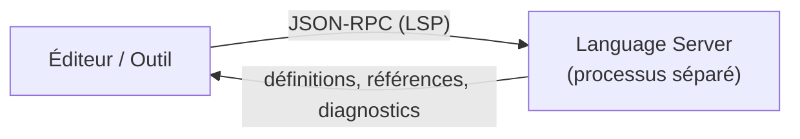

# 212 — LSP — le Language Server Protocol avec Copilot

**Durée** : ~40 min · **Complexité** : ⭐⭐ · **Pré-requis** : [106 — MCP](../01-fondations/106-mcp.md), [210 — Copilot CLI](./210-copilot-cli.md)

> *Copilot ne lit pas seulement ton code comme du texte. Via le Language Server Protocol, il peut « aller à la définition », « trouver les références » ou « renommer un symbole » avec la précision du compilateur — dans VS Code comme dans le terminal.*

## Objectif

À la fin de ce module, tu sais :

- Expliquer ce qu'est le Language Server Protocol (LSP) et le problème qu'il résout.
- Décrire comment Copilot exploite les language services dans VS Code (`#search/usages`, `#read/problems`).
- Comprendre comment Copilot CLI utilise automatiquement les LSP servers de tes langages.
- Configurer un LSP server pour Copilot CLI via `.github/lsp.json` ou `~/.copilot/lsp-config.json`.

## Ce que tu vas apprendre

1. Ce qu'est le LSP et pourquoi il existe
2. Copilot qui exploite les language services de VS Code (`#search/usages`, `#codebase`)
3. Copilot CLI qui consomme les LSP servers depuis le terminal
4. Configurer un LSP server pour la CLI

## Contenu pédagogique

### Qu'est-ce que le Language Server Protocol

Implémenter l'autocomplétion, le *go-to-definition* ou la documentation au survol pour un langage représente un effort considérable. Traditionnellement, ce travail devait être refait pour **chaque** outil de développement, car chacun expose des API différentes pour les mêmes fonctionnalités.

> Source: https://microsoft.github.io/language-server-protocol/overviews/lsp/overview/
> Citation: "Implementing support for features like autocomplete, goto definition, or documentation on hover for a programming language is a significant effort. Traditionally this work must be repeated for each development tool."
> Fetched: 2026-06-06

L'idée du LSP est de **standardiser** le protocole de communication entre les outils et les *language servers*, pour qu'un seul serveur soit réutilisable dans plusieurs outils.

> Source: https://microsoft.github.io/language-server-protocol/overviews/lsp/overview/
> Citation: "The idea behind the Language Server Protocol (LSP) is to standardize the protocol for how tools and servers communicate, so a single Language Server can be re-used in multiple development tools."
> Fetched: 2026-06-06

Concrètement, un *language server* tourne comme un **processus séparé** et les outils communiquent avec lui via le protocole, en **JSON-RPC**.

> Source: https://microsoft.github.io/language-server-protocol/overviews/lsp/overview/
> Citation: "A language server runs as a separate process and development tools communicate with the server using the language protocol over JSON-RPC."
> Fetched: 2026-06-06



C'est un standard ouvert : un « LSP server » est n'importe quel language server qui implémente ce protocole.

> Source: https://raw.githubusercontent.com/github/docs/main/content/copilot/concepts/agents/copilot-cli/lsp-servers.md
> Citation: "The Language Server Protocol (LSP) is an open standard used for communication between a code editor and a language server. … An \"LSP server\" is any language server that supports the Language Server Protocol."
> Fetched: 2026-06-06

### Copilot qui exploite les language services (VS Code)

L'autre direction existe aussi *dans l'éditeur* : Copilot s'appuie sur les **language services** de VS Code — c'est-à-dire les language servers de tes langages — pour cadrer son contexte.

VS Code expose à l'agent des **outils** directement adossés au language service — l'agent les appelle sans que tu aies à ouvrir le fichier concerné. Le plus parlant est `#search/usages`, qui combine *Find All References*, *Find Implementation* et *Go to Definition* — exactement les opérations LSP.

> Source: https://raw.githubusercontent.com/microsoft/vscode-docs/main/docs/agents/reference/copilot-vscode-features.md
> Citation: "`#search/usages` | Combination of \"Find All References\", \"Find Implementation\", and \"Go to Definition\"."
> Fetched: 2026-06-06

De même, `#read/problems` ajoute au contexte les diagnostics du panneau **Problems** — qui sont eux-mêmes produits par les language servers de tes langages.

> Source: https://raw.githubusercontent.com/microsoft/vscode-docs/main/docs/agents/reference/copilot-vscode-features.md
> Citation: "`#read/problems` | Add workspace issues and problems from the **Problems** panel as context. Useful while fixing code or debugging."
> Fetched: 2026-06-06

**À ne pas confondre avec le `#`-symbole.** Ajouter *manuellement* un symbole au contexte (`#monSymbole` via le picker) est la seule action qui exige que le fichier contenant ce symbole soit **ouvert** dans l'éditeur. C'est une contrainte du *picker de symboles*, pas une règle sur l'usage du LSP : `#search/usages` et `#read/problems`, eux, n'en dépendent pas.

> Source: https://raw.githubusercontent.com/microsoft/vscode-docs/main/docs/chat/copilot-chat-context.md
> Citation: "To reference a symbol, make sure to open the file containing the symbol in the editor first."
> Fetched: 2026-06-06

Enfin, par défaut, VS Code **indexe ton workspace** pour inclure automatiquement les fichiers pertinents ; tu peux forcer l'ensemble du dépôt avec `#codebase`.

> Source: https://raw.githubusercontent.com/microsoft/vscode-docs/main/docs/chat/copilot-chat-context.md
> Citation: "By default, VS Code performs uses workspace indexing to automatically include relevant files as context based on the conversation." / "you can add `#codebase` to your prompt."
> Fetched: 2026-06-06

La symétrie avec la CLI est donc réelle : plutôt que d'envoyer des fichiers entiers, l'agent s'appuie sur la connaissance structurée du language service (références, définitions, diagnostics). Même bénéfice de précision et de sobriété, côté éditeur.

### Copilot CLI qui consomme les LSP servers (sans VS Code)

Seconde direction, sans IDE : **Copilot CLI utilise les LSP servers de tes langages** pour comprendre la structure de ton code avec précision, directement depuis le terminal.

> Source: https://raw.githubusercontent.com/github/docs/main/content/copilot/concepts/agents/copilot-cli/lsp-servers.md
> Citation: "Copilot CLI can use LSP servers to understand the structure of your code more precisely."
> Fetched: 2026-06-06

Quand un LSP server est disponible, la CLI **l'utilise automatiquement** — elle préfère une opération LSP à une recherche textuelle dès qu'elle le peut.

> Source: https://raw.githubusercontent.com/github/docs/main/content/copilot/concepts/agents/copilot-cli/lsp-servers.md
> Citation: "When LSP servers are available, Copilot CLI uses them automatically. You don't need to explicitly request it."
> Fetched: 2026-06-06

Les opérations supportées :

| Opération | Ce qu'elle fait |
|---|---|
| Go to definition | Saute à l'endroit où un symbole (fonction, classe, variable) est défini. |
| Find references | Trouve chaque endroit où un symbole est utilisé. |
| Hover | Récupère le type et la documentation d'un symbole. |
| Rename | Renomme un symbole dans tout le projet, en mettant à jour les références. |
| Document symbols | Liste tous les symboles définis dans un fichier. |
| Workspace symbol search | Cherche des symboles par nom dans tout le projet. |
| Go to implementation | Trouve les implémentations d'une interface ou méthode abstraite. |
| Incoming / Outgoing calls | Montre qui appelle une fonction, et ce qu'elle appelle. |

> Source: https://raw.githubusercontent.com/github/docs/main/content/copilot/concepts/agents/copilot-cli/lsp-servers.md
> Citation: "The following language server operations are supported: Go to definition … Find references … Hover … Rename … Document symbols … Workspace symbol search … Go to implementation … Incoming calls … Outgoing calls."
> Fetched: 2026-06-06

L'intérêt rejoint directement la sobriété en tokens (bloc 3) : une opération comme « trouver les références » renvoie un **résultat structuré compact** au lieu d'obliger l'agent à charger des fichiers entiers dans la conversation.

> Source: https://raw.githubusercontent.com/github/docs/main/content/copilot/concepts/agents/copilot-cli/lsp-servers.md
> Citation: "Token efficiency: Operations like \"list all symbols\" or \"find references\" return compact structured results instead of requiring the agent to read entire files into the conversation."
> Fetched: 2026-06-06

### Configurer un LSP server pour la CLI

D'abord, installe le language server du langage visé. Exemple pour TypeScript / JavaScript :

```bash
npm install -g typescript typescript-language-server
```

> Source: https://raw.githubusercontent.com/github/docs/main/content/copilot/how-tos/copilot-cli/set-up-copilot-cli/add-lsp-servers.md
> Citation: "npm install -g typescript typescript-language-server"
> Fetched: 2026-06-06

Ensuite, déclare-le dans l'un des deux fichiers de configuration — même syntaxe JSON pour les deux :

- **Config projet** : `.github/lsp.json`, dans ton dépôt, s'applique à toute l'équipe.
- **Config utilisateur** : `~/.copilot/lsp-config.json`, s'applique à tous tes projets.

```json
{
  "lspServers": {
    "typescript-language-server": {
      "command": "typescript-language-server",
      "args": ["--stdio"],
      "fileExtensions": {
        ".ts": "typescript",
        ".tsx": "typescriptreact",
        ".js": "javascript",
        ".jsx": "javascriptreact"
      }
    }
  }
}
```

> Source: https://raw.githubusercontent.com/github/docs/main/content/copilot/how-tos/copilot-cli/set-up-copilot-cli/add-lsp-servers.md
> Citation: "Both files use the same JSON syntax: { \"lspServers\": { \"SERVER-NAME\": { \"command\": \"COMMAND\", \"args\": [\"ARG1\", \"ARG2\"], \"fileExtensions\": { \".EXT\": \"LANGUAGE-ID\" } } } }"
> Fetched: 2026-06-06

Les champs `command` et `fileExtensions` sont **requis** ; `args` et `env` sont optionnels.

> Source: https://raw.githubusercontent.com/github/docs/main/content/copilot/how-tos/copilot-cli/set-up-copilot-cli/add-lsp-servers.md
> Citation: "command … Yes … args … No … fileExtensions … Yes … env … No"
> Fetched: 2026-06-06

Au démarrage, la CLI charge les configurations LSP par ordre de priorité : **config projet** (`.github/lsp.json`) > **plugins** > **config utilisateur** (`~/.copilot/lsp-config.json`). Une fois le répertoire de travail approuvé, la CLI démarre en arrière-plan les serveurs pertinents.

> Source: https://raw.githubusercontent.com/github/docs/main/content/copilot/concepts/agents/copilot-cli/lsp-servers.md
> Citation: "1. Project config: `.github/lsp.json` in the current repository. 2. Plugin configs … 3. User config: `~/.copilot/lsp-config.json`." / "Copilot CLI automatically starts any LSP servers that are relevant to your project, in the background."
> Fetched: 2026-06-06

### Les directions, résumées

| | Copilot dans VS Code | Copilot CLI |
|---|---|---|
| Comment | `#search/usages`, `#read/problems`, `#codebase` | LSP servers déclarés, utilisés automatiquement |
| Déclenchement | l'agent appelle l'outil adossé au language service | piloté par ton prompt en langage naturel |
| Config | aucune (intégrée) | `.github/lsp.json` / `~/.copilot/lsp-config.json` |
| Bénéfice | précision + sobriété, dans l'éditeur | précision + sobriété en tokens, sans IDE |

## Exercice

**Énoncé** — En 20 minutes, tu vas donner à Copilot CLI une intelligence de code précise sur un projet TypeScript.

**Étapes guidées** :

1. Installe le serveur : `npm install -g typescript typescript-language-server`.
2. Crée `.github/lsp.json` à la racine de ton dépôt avec la config TypeScript ci-dessus.
3. Lance `copilot` dans le terminal, approuve le répertoire de travail.
4. Demande : « où est défini `maFonction` ? » puis « trouve toutes les références à `maFonction` ».
5. Compare avec une recherche purement textuelle (`grep`) : observe que le LSP trouve la *vraie* définition, pas une correspondance de texte.

**Critère de réussite** : Copilot CLI répond en s'appuyant sur l'opération LSP (go-to-definition / find references), et non sur une recherche textuelle.

## Validation

Tu peux passer au module suivant si :

- [ ] Tu sais expliquer en une phrase ce que standardise le LSP.
- [ ] Tu sais nommer deux outils VS Code adossés au LSP (`#search/usages`, `#read/problems`).
- [ ] Tu sais où se configurent les LSP servers de la CLI (`.github/lsp.json`, `~/.copilot/lsp-config.json`).
- [ ] Tu as fait répondre Copilot CLI via une opération LSP sur un vrai projet.

## Pour aller plus loin

- [Language Server Protocol](https://microsoft.github.io/language-server-protocol/) — le site officiel du protocole.
- [Implémentations de language servers](https://microsoft.github.io/language-server-protocol/implementors/servers/) — la liste par langage.
- [Module 311 — Tokens & contexte](../03-ingenierie-de-contexte/311-tokens-contexte.md) — pourquoi des résultats LSP compacts réduisent la facture.

## Module suivant

**Suivant** : [311 — Tokens et contexte](../03-ingenierie-de-contexte/311-tokens-contexte.md)

## Sources

1. https://microsoft.github.io/language-server-protocol/overviews/lsp/overview/ — overview LSP officiel
2. https://github.com/microsoft/vscode-docs — `docs/agents/reference/copilot-vscode-features.md`, `docs/chat/copilot-chat-context.md` (fetched 2026-06-06)
3. https://github.com/github/docs — `content/copilot/concepts/agents/copilot-cli/lsp-servers.md` et `.../how-tos/copilot-cli/set-up-copilot-cli/add-lsp-servers.md` (fetched 2026-06-06)
