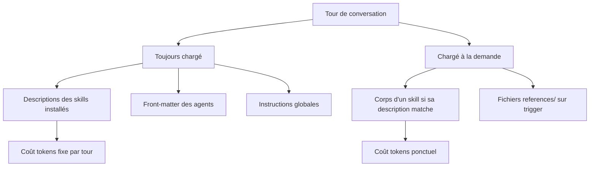

# 213 — Distribuer ses primitives — APM, plugins, symlink, outils tiers

Durée estimée : 25 min

> Tu sais créer des primitives. Mais quand l'équipe grandit, comment les partager sans copier-coller ? Quatre modes répondent à cette envie — APM, plugin, `git clone` + `symlink`, et les outils tiers comme `skill.sh`. Aucun n'est universellement meilleur : ils troquent différemment **portée**, **version** et **tokens**.

## Pourquoi ce module

Réutiliser des primitives sans les recopier à la main : c'est le même besoin pour les quatre modes. Ce qui change, c'est le compromis.

- **APM** — déclare les primitives **par projet** (`apm.yml` + `apm.lock.yaml`). Qui clone obtient la config exacte.
- **Plugin** — un bundle installé **sur la machine** du dev. Une fois posé, il le suit partout.
- **Git clone + symlink** — un dépôt partagé cloné une fois, **lié par `symlink` dans le dépôt de travail**. Un `git pull` garde tout à jour.
- **Outils tiers légers** (ex. `skill.sh`) — un installeur de skills en shell, scriptable.

Ce choix décide de **qui voit quoi**, de **qui reste synchronisé**, et de **combien de tokens** tu paies à chaque tour de conversation. Ce module met les quatre modes sur la même ligne et les confronte à quatre scénarios d'équipe.

## Pré-requis

- [Module 207 — APM — installer et partager](./207-apm.md) — tu dois savoir lire un `apm.yml` et un lockfile.
- [Module 209 — Plugins — découvrir et installer](./209-plugins.md) — tu dois savoir installer un plugin et distinguer les scopes user/project.
- [Module 105 — Hooks](../01-fondations/105-hooks.md) — pour le volet sécurité en fin de module.

Rappel express des primitives en jeu :

- Un **`skill`** : un dossier de connaissances/procédures chargé **à la demande** quand sa description matche la tâche.
- Un **`agent`** : une persona avec ses outils et son périmètre, invoquée explicitement ou par dispatch.
- Un **`hook`** : un script déclenché par un événement (avant commit, après édition…), qui ne consomme pas la fenêtre de contexte tant qu'il ne s'exécute pas.
- Un **`plugin`** : un **bundle** qui empaquette plusieurs de ces primitives (skills + agents + hooks + MCP) et s'installe d'un bloc.

## Concepts clés

### Les quatre modes de distribution

**APM** orchestre la distribution de **toutes** les primitives, versionnée et lockée par projet. Tu déclares une dépendance dans `apm.yml` :

```yaml
dependencies:
  - AxaFrance/design-system/plugins/canopee-distributeur
```

**Plugin** : un mode de **packaging et d'installation**, souvent global à la machine. Tu l'installes une fois depuis le marketplace, puis il se met à jour automatiquement.

**Git clone + symlink** : tu clones une fois le dépôt partagé, puis tu poses un `symlink` **dans le dépôt de code où tu travailles** (son dossier `.agents/` ou `.github/`) — pas dans la config user. Un `git pull` sur le clone propage la dernière version à tous les projets liés.

```bash
# 1. Cloner le dépôt partagé une fois sur la machine
git clone git@github.com:axafrance/shared-skills.git ~/.copilot-skills

# 2. Le lier DANS le dépôt de travail courant (pas dans la config user)
cd ~/work/mon-projet
ln -s ~/.copilot-skills/.agents/skills .agents/skills

# 3. Rester à jour : un pull sur le clone suffit pour tous les projets liés
git -C ~/.copilot-skills pull
```

:::caution Attention au dépôt GLOBAL multi-stack
Souvent le dépôt partagé est un **catalogue global** qui mélange tous les stacks : skills Python, React, Java, .NET, et d'autres. Si tu lies le dépôt **en entier**, tu charges les descriptions des skills .NET et Java même sur un projet purement React — exactement le **coût « partout »** qu'on reproche au plugin (chaque description est chargée dans chaque repo, même hors sujet). La parade : ne pose le `symlink` que sur le **sous-dossier pertinent** (`ln -s ~/.copilot-skills/.agents/skills/react .agents/skills`), pas sur la racine. Un dépôt global lié sans discernement annule l'avantage « ciblé » du symlink par repo.
:::

**Outils tiers légers** (ex. `skill.sh`) : un installeur de skills en shell, à mi-chemin entre le plugin et APM. L'interface exacte dépend de l'outil ; l'idée est un script minimaliste qui récupère un skill depuis un dépôt.

```bash
# Exemple d'outil tiers léger (l'interface exacte dépend de l'outil)
skill.sh install axafrance/design-system
```

Vue d'ensemble :

| Mode | Porte quoi | Portée | Version épinglée | Synchronisation |
|---|---|---|---|---|
| **APM** | skills, agents, prompts, hooks, MCP | le **projet** | oui (`apm.lock.yaml`) | clone si le `.github/`/`.agents/` compilé est commité ; sinon `apm install` une fois |
| **Plugin** | bundle de primitives | la **machine** (ou le projet) | non par défaut | install **≥ 1 fois** par machine, puis auto |
| **Git clone + symlink** | ce que contient le dépôt lié | **dépôt de travail** (souvent) ou user | non (`HEAD`) | `git pull` manuel |
| **`skill.sh` (tiers)** | skills | selon l'outil | rarement | selon l'outil |

### Comment les tokens se consomment

Rappelle-toi ce qui entre dans la fenêtre de contexte **à chaque tour**.



Le point décisif : **les descriptions sont toujours chargées**, le corps ne l'est qu'au déclenchement. La règle vaut pour les quatre modes :

- Tout ce qui est installé **largement** (plugin user, symlink dans la config user, outil tiers global) rend ses descriptions candidates **dans tous tes dépôts**, même hors sujet. C'est un **coût « partout »** : tu le payes dans chaque repo, même là où la primitive ne sert à rien.
- Tout ce qui est déclaré **par projet** (APM, symlink dans le dépôt de travail, outil tiers en mode projet) ne charge que les descriptions pertinentes → contexte ciblé.

Retiens : *plus une primitive est installée largement, plus elle pèse sur des tâches où elle est inutile.* Ce n'est donc pas « plugin vs APM » qui décide des tokens, mais **la portée de l'installation** — où et à quel point tu l'installes largement.

#### Combien coûte une en-tête de skill, en tokens ?

Ce qui est « toujours chargé », c'est le **nom + la description** de chaque skill (sa frontmatter). On peut le chiffrer avec deux repères :

- règle de conversion : **~4 caractères = 1 token** ;
- plafond canonique d'une `description` de skill : **1024 caractères**.

| Cas | Taille description | En-tête (nom + desc + formatage) |
|---|---|---|
| **Minimum** (description courte, ~100 car.) | ~25 tokens | **~35–50 tokens** |
| **Maximum** (description au plafond, 1024 car.) | ~256 tokens | **~270–300 tokens** |

Une en-tête de skill coûte donc **entre ~35 et ~300 input tokens**, **à chaque tour**. Multiplie par le nombre de skills installés : 20 skills à ~150 tokens en moyenne = **~3000 input tokens fixes** ajoutés à chaque message — qu'ils servent ou non.

Ces tokens sont des **input tokens** : ils font partie du prompt envoyé au modèle à chaque interaction. Leur coût n'est pas la facture en elle-même mais **le budget de contexte** — la place qu'ils occupent dans la fenêtre et qu'ils retirent à ton code et à ta question. Plus tu installes large, plus cette part fixe grossit, utile ou non.

:::note Repère
Les ~4 car./token et le plafond de 1024 caractères sont des ordres de grandeur ; le découpage exact dépend du tokenizer du modèle.
:::

:::caution État à date du 29 juin 2026
Cette comparaison repose sur un fait du moment : un `plugin` installé en scope user est **actif dans tous tes dépôts**, sans filtre par repo. Tout le raisonnement « coût partout » en découle. Si demain l'écosystème permet d'**activer ou désactiver un plugin par dépôt**, l'argument tokens contre les plugins tombe en grande partie — et plusieurs recos de ce module pourraient changer complètement. Revérifie l'état de cette fonctionnalité avant de figer ta stratégie.
:::

## Démonstration — quatre scénarios d'équipe

Pour chaque scénario, les **quatre modes** sont comparés (positif / négatif / impact tokens), puis une reco.

:::note Modère chaque reco à l'échelle de la squad
Chaque scénario décrit un **profil dominant**, pas une équipe homogène. Dans une même squad, une dev full-stack peut très bien intervenir sur `front-app-1` pendant qu'une autre n'y touche jamais. La bonne maille de décision n'est donc pas le dev isolé mais le **groupe** : dès qu'un seul membre croise plusieurs stacks ou plusieurs repos, les profils se mélangent et l'avantage « tokens ciblés » d'une installation par projet (APM) se renforce. Lis chaque reco ci-dessous avec sa ligne « À l'échelle de la squad ».
:::

### Scénario A — Équipe multi-repo, développeur full-stack

Le dev jongle entre un repo `front`, un repo `back`, un repo `infra`.

| Mode | Positif | Négatif | Impact tokens |
|---|---|---|---|
| **APM** | Chaque repo déclare son besoin ; lockfile = cohérence | 3 manifestes à maintenir | Bas, **ciblé** : `front` ne charge pas les outils `back` |
| **Plugin** | Installé une fois, suit le dev dans les 3 repos, auto-update | Install ≥ 1 par machine ; aucune trace dans les repos | Élevé, **chargé partout** : chargé même sur `infra` où il ne sert pas |
| **Symlink** | Une source sur la machine, à jour via `git pull`, posé par repo de travail | Setup + pull manuels, `HEAD` non épinglé, fragile sous Windows | Ciblé si tu lies le **sous-dossier du stack** ; chargé partout si tu lies un dépôt global multi-stack en entier ou en config user |
| **Tiers** | Léger, installable par repo dans un script | Pas de lockfile ni de résolution transitive | Ciblé si installé par projet |

> Recommandation : full-stack multi-repo → **APM** pour la cohérence et des tokens ciblés. Le **symlink** dépanne un dev solo qui veut le dernier `HEAD` sans cérémonie.
>
> À l'échelle de la squad : si d'autres membres sont mono-stack et ne touchent qu'`front` ou `back`, APM par repo les sert encore mieux — chacun ne charge que son repo, et la full-stack obtient le bon contexte en passant de l'un à l'autre. Le profil mixte **plaide pour APM**.

### Scénario B — Équipe mono-repo, front et back ensemble

Front et back vivent dans le **même dépôt**, un périmètre unique.

| Mode | Positif | Négatif | Impact tokens |
|---|---|---|---|
| **APM** | Un seul `apm.yml`, lockfile partagé ; clone suffit si le compilé est commité | Écrire le manifeste au départ | Bas, **ciblé** : exactement les primitives du projet |
| **Plugin** | Installation rapide, bundle clé en main | Hors du versioning ; install ≥ 1 par dev | Moyen : un seul périmètre, peu de bruit |
| **Symlink** | À jour via `git pull`, lié dans le dépôt de travail | Setup par dev, pas partagé par le versioning, `HEAD` non épinglé | Ciblé si tu lies le sous-dossier du stack ; chargé partout si tu lies un dépôt global en entier |
| **Tiers** | Scriptable dans le `Makefile` du repo | Garanties faibles, gouvernance à définir | Ciblé si installé par projet |

> Recommandation : mono-repo → **APM** gagne nettement. Un manifeste, un lockfile, et tout nouvel arrivant obtient la config exacte au clone. Exemple : partager le `skill` maison du design system, hébergé dans `axafrance/design-system`, en une ligne d'`apm.yml` — le skill vit dans son dépôt source, le projet consommateur ne fait que le **déclarer**.
>
> À l'échelle de la squad : le dépôt unique aligne d'office tout le monde, quel que soit le profil (full-stack ou spécialisé) — un seul manifeste sert toute la squad. C'est le cas le plus robuste aux profils mixtes.

### Scénario C — Plusieurs équipes dans un même monorepo

Un seul stack, un **monorepo**, mais découpé en **domaines** appartenant chacun à une équipe différente. Concrètement, un dossier par domaine, chacun avec ses propres besoins :

```text
monorepo/
  paiement/      ← équipe Paiement
  catalogue/     ← équipe Catalogue
  compte/        ← équipe Compte
```

Chaque équipe a ses propres skills/agents ; personne n'a besoin de ceux des deux autres au quotidien.

:::note Équipes par domaine ≠ feature teams
Ce scénario suppose des **équipes par domaine** (component / domain teams) : chacune possède son dossier (`paiement/`, `catalogue/`…), à la manière des bounded contexts DDD. À ne pas confondre avec des **feature teams**, qui livrent une fonctionnalité **de bout en bout en traversant plusieurs domaines**. Si ton organisation fonctionne en feature teams, tout le monde circule partout : tu retombes sur le profil transverse (voir la note squad ci-dessous et le Scénario D). Le bon choix dépend donc autant du **modèle d'organisation** que de la techno.
:::

| Mode | Positif | Négatif | Impact tokens |
|---|---|---|---|
| **APM** | Périmètre déclarable **par domaine/dossier** ; isolation | Gouvernance à organiser (qui possède quel manifeste) | Bas par équipe : chacun ne charge que son sous-ensemble |
| **Plugin** | Une baseline commune sur chaque machine | Bruit inter-équipes : l'équipe Paiement charge aussi les outils de Catalogue | Élevé : tout le catalogue est chargé partout pour tous |
| **Symlink** | Un clone partagé, à jour via `git pull` | Pas d'isolation par domaine native ; même bruit si lié trop largement | Ciblé si tu lies le sous-dossier du domaine ; chargé partout si le dépôt global est lié en entier |
| **Tiers** | Scripté par équipe dans la CI | Gouvernance + pas de lockfile | Selon l'installation |

> Recommandation : plusieurs équipes dans un monorepo → **APM** pour isoler le contexte par domaine. Les autres modes conviennent surtout pour une **baseline strictement commune** à toutes les équipes.
>
> À l'échelle de la squad : ici une squad = une équipe (un domaine du monorepo). La plupart des devs restent dans leur domaine, mais certains sont **transverses** et passent d'un domaine à l'autre. Si tu isoles tout strictement par domaine, ceux-là doivent recharger une config à chaque changement. La parade tient en deux couches : (1) une **baseline commune** — ce dont tout le monde a besoin quel que soit le domaine — installée pour tous ; (2) les primitives **propres à chaque domaine**, déclarées en APM dans son dossier. Résultat : chacun charge `baseline + domaine courant`, jamais le catalogue de toutes les équipes réunies.

### Scénario D — Développeur mono-stack, multi-repo

Le dev ne touche qu'**un seul stack** (ex. React) mais le répartit sur plusieurs dépôts : `front-app-1`, `front-app-2`, `design-system`. C'est le cas qui réhabilite le plugin.

| Mode | Positif | Négatif | Impact tokens |
|---|---|---|---|
| **APM** | Cohérence + version épinglée par repo | Le **même** jeu de deps recopié dans N manifestes presque identiques | Bas, **ciblé** |
| **Plugin** | Installé une fois, pertinent dans **tous** ses repos puisqu'ils sont du même stack ; auto-update | Install ≥ 1 par machine ; pas de version épinglée | **Bas** : ici ce coût « partout » disparaît — tout ce qu'il touche **est** ce stack, rien d'inutile n'est chargé |
| **Symlink** | Un clone du stack lié dans chaque repo (ou en user, sans risque puisque mono-stack) | Setup + pull manuels, `HEAD` non épinglé | Bas : mono-stack → même une installation au niveau user reste pertinente partout |
| **Tiers** | Léger, un seul stack à gérer | Garanties faibles | Bas |

> Recommandation : mono-stack multi-repo → c'est le scénario où **plugin** (ou symlink user) redevient compétitif : comme tous les repos partagent le stack, l'argument « coût partout » tombe. Le choix se joue alors sur **version épinglée + cohérence** (→ APM) contre **simplicité du geste unique** (→ plugin). Si la reproductibilité d'équipe prime, garde APM ; pour un dev solo, le plugin suffit.
>
> À l'échelle de la squad : c'est là que la nuance est décisive. Si **une seule** dev de la squad est full-stack et passe sur `front-app-1` **puis** sur le back, la diversité de stacks réapparaît au niveau du groupe — et pour elle le plugin redevient « chargé partout ». Tranche au niveau squad, pas au dev : squad **réellement** 100 % mono-stack → plugin acceptable ; dès qu'un membre croise les stacks → **APM par repo** protège tout le monde sans imposer de coût « partout ».

### Synthèse

| Mode | Portée | Mise à jour | Version épinglée | Tokens |
|---|---|---|---|---|
| **APM** | projet | clone (si compilé commité) ou `apm install` | oui (`apm.lock.yaml`) | ciblé |
| **Plugin** | machine | auto après 1ʳᵉ install | non par défaut | chargé partout |
| **Git clone + symlink** | dépôt de travail ou user | `git pull` manuel | non (`HEAD`) | selon la portée |
| **`skill.sh` (tiers)** | selon l'outil | selon l'outil | rarement | selon installation |

Le critère reste le même pour les quatre : **portée voulue** (projet vs machine) et **garantie de version** (lockée vs `HEAD`). APM est le seul à offrir périmètre projet **et** version épinglée ; les trois autres troquent l'une contre la simplicité.

### APM tout le temps ? Non

Les quatre scénarios penchent vers APM — mais ce n'est pas un réflexe universel. APM gagne dès qu'il y a **diversité de profils** ou besoin de **version épinglée** ; il cède la place quand :

- **squad réellement 100 % mono-stack** (Scénario D) → le plugin (ou un symlink user) suffit, sans coût « partout » puisque tout est pertinent ;
- **outil transverse qui doit s'appliquer partout sans exception** (secret-scan de sécurité, *token killer* comme `SNIP`) → côté machine, justement pour qu'aucun repo ne puisse y échapper (voir ci-dessous) ;
- **dev solo ou prototypage** → le geste unique d'un plugin ou d'un `git clone` + symlink évite la cérémonie du manifeste ;
- **tu veux le dernier `HEAD` en continu** plutôt qu'une version lockée → le symlink + `git pull` est plus direct ;
- **tu as des tokens « illimités »** (forfait sans facturation au token) → l'argument « coût partout » disparaît : tu peux te permettre d'installer large. Mais attention, ce n'est pas gratuit pour autant : charger des dizaines de descriptions inutiles **dilue le contexte** et peut **dégrader la qualité** des réponses (le modèle disperse son attention sur du bruit). Tu ne payes plus en euros, tu payes en **pertinence** — un nouveau souci qui remplace l'ancien.

Autrement dit : APM est le **défaut raisonnable en équipe**, pas une règle absolue. Garde les autres modes pour le transverse universel et le solo — ce que la section suivante illustre sur la sécurité et l'optimisation des tokens.

## Exercice

Quatre parties indépendantes, de la plus simple à la plus exigeante.

:::tip Fais-le en réunion d'équipe
Cet exercice prend toute sa valeur **en collectif**. Propose-le lors d'un point d'équipe : projette la mesure de la Partie A sur un vrai projet, fais deviner aux collègues quels skills pèsent le plus à l'initialisation d'une conversation, puis débattez ensemble des Parties B à D. L'objectif n'est pas seulement de trancher, mais de **challenger les choix actuels** et d'**expliquer le raisonnement** (portée de l'installation, coût « partout », modération squad) à ceux qui ne l'ont pas encore en tête. Une décision de distribution se prend mieux à plusieurs qu'imposée par une seule personne.
:::

### Partie A — Mesure l'empreinte « toujours chargée » ⭐

Ce qui pèse à chaque tour, c'est la **description** de chaque skill/agent. Mesure-la sur un de tes projets, de façon déterministe. La commande ci-dessous ne suppose **pas** APM : elle cherche les emplacements courants (`.github/`, `.agents/`, `.claude/`) **et** tous les `SKILL.md` / `*.agent.md` où qu'ils soient.

```bash
# Empreinte de chaque description (≈ ce qui est toujours chargé), avec ou sans APM
{ find . -type f \( -name 'SKILL.md' -o -name '*.agent.md' \) 2>/dev/null
  find .github .agents .claude -type f -name '*.md' 2>/dev/null
} | sort -u | while read -r f; do
  chars=$(awk '/^description:/{flag=1} flag{print} /^---$/{if(flag) exit}' "$f" | wc -c)
  [ "$chars" -gt 1 ] && printf '%5d car  ~%4d tokens  %s\n' "$chars" $((chars / 4)) "$f"
done | sort -rn
```

> Les **plugins installés sur ta machine** vivent **hors du dépôt** : cette commande ne les voit pas. Elle mesure l'empreinte portée par le **projet** ; pour les plugins machine, liste-les côté VS Code (Partie D, point 4).

Réponds : quel est le **total** approximatif en input tokens ? Quels sont les **3 plus gros** contributeurs ? Si tu n'en utilises que la moitié au quotidien, combien de tokens une installation **par projet** te ferait-elle économiser à chaque message ?

### Partie B — Le piège du mono-stack ⭐⭐

Une squad se présente comme **« 100 % React »** et veut donc installer ses skills en **plugin** (geste unique, tout est pertinent). Mais une de ses développeuses est en réalité **full-stack** : elle intervient sur `front-app-1` **et** sur le service back en Java.

1. Où est le piège ? Qu'arrive-t-il à l'argument « coût partout » pour **elle** ?
2. Tranche au niveau **squad** (pas au dev moyen) : plugin ou APM ? Justifie avec **un** argument tokens **et** **un** argument cohérence.

### Partie C — Place trois outils ⭐⭐

Pour chacun, dis **côté machine** (plugin / symlink user) ou **APM (projet)**, en une phrase de justification :

1. **CAVEMAN**, instruction de réduction de token.
2. **SNIP**, le *token killer*, livré comme **hook**.
3. le **design system**, livré comme **plugin**, propre à l'app `front-app-1`.

> Indice : repose-toi sur la question qui tranche — *cet outil doit-il s'appliquer partout sans exception, ou son périmètre dépend-il du projet ?* Et remarque que le **type de primitive** (hook ou plugin) ne décide pas du **mode de distribution** : un hook comme un plugin peut être posé côté machine **ou** déclaré côté projet — la vraie question reste « machine ou projet ? ».

### Partie D — Audit d'un de tes vrais projets ⭐⭐⭐

Ouvre un projet réel sur lequel tu travailles et réponds, preuves à l'appui :

1. **Coût des en-têtes** : pour chaque skill dont tu as réellement besoin, mesure le coût de son en-tête (réutilise la commande de la Partie A). Quel est le **total** toujours chargé ?
2. **Non versionné = potentiellement périmé** : combien de skills/agents ne sont **pas versionnés** (installés hors APM, donc sans lockfile) ? Lesquels risquent d'être **désynchronisés** d'une machine à l'autre dans l'équipe ?
3. **Tes skills de repo sont-ils trop larges ?** : parmi les skills déclarés dans le repo, lesquels s'appliquent **tout le temps, hors stack** (universels) ? Ceux-là gagneraient peut-être à passer **côté machine** au lieu d'être redéclarés dans chaque repo.
4. **Tes plugins machine sont-ils vraiment universels ?** : à l'inverse, parmi les plugins installés sur ta machine, lesquels ne sont **pas pertinents partout** ? Ceux-là te coûtent « partout » pour rien → candidats à un passage **en APM par projet**.
5. **Onboarding documenté ?** : comme un plugin ne laisse **aucune trace dans le repo**, vérifie qu'un **README** (ou un guide de démarrage) existe et **mentionne les skills/plugins utiles** pour qu'un nouveau dev sache quoi installer. S'il manque, écris-le.

## Validation

Tu as réussi si tu sais :

- citer les **quatre modes** de distribution et, pour chacun, sa portée et sa garantie de version ;
- expliquer pourquoi l'impact tokens dépend de **la portée de l'installation** (projet vs machine), pas du nom de l'outil ;
- trancher les **quatre scénarios** avec un argument tokens et un argument cohérence ;
- **modérer chaque reco à l'échelle de la squad** : reconnaître qu'un profil mixte (une full-stack qui passe sur `front-app-1`) déplace le bon choix vers une installation par projet ;
- justifier le **placement d'un outil transverse** (hook de sécurité, *token killer* comme `SNIP`) plutôt côté machine.

## Pour aller plus loin — le cas du hook de sécurité

Question ouverte, à débattre dans ton équipe : un **hook de sécurité** — par exemple un scanner de secrets type `gitleaks` déclenché avant chaque commit — vaut-il mieux côté **machine** (plugin, symlink user) ou côté **projet** (APM) ?

- **Côté machine** : présent sur **toutes** les machines, indépendant du repo, difficile à contourner par oubli de déclaration. Idéal pour une règle **non négociable** qui doit s'appliquer partout.
- **Côté projet (APM)** : versionné, auditable, mais ne s'active **que si le repo le déclare** — un repo qui oublie la dépendance n'est pas protégé.

Le compromis :

- sécurité **non négociable** et universelle (secret-scan, blocage de push de credentials) → **côté machine**, pour qu'aucun repo ne puisse y échapper ;
- politique **spécifique au projet** (règles métier, conventions d'un domaine) → **APM**, pour la versionner et l'auditer avec le code.

Et côté tokens : un hook ne consomme la fenêtre de contexte **que lorsqu'il s'exécute** — son coût « toujours chargé » se limite à sa déclaration. C'est donc une primitive **peu coûteuse** à généraliser.

### Deuxième cas : SNIP, un *token killer* transverse

`SNIP` est un outil de réduction de contexte — un *token killer* : il découpe et compresse ce qu'on envoie au modèle pour faire baisser la facture de tokens. Où le placer ?

- **Côté machine (plugin)** : tu veux qu'il agisse sur **chaque** session, dans **chaque** repo, sans que personne n'ait à y penser. Son bénéfice est transverse (il fait *économiser* des tokens partout) et son propre coût « partout » est négligeable. C'est le profil parfait du plugin.
- **Côté projet (APM)** : possible, mais tu limites l'outil aux seuls repos qui le déclarent — alors que son intérêt est justement d'être **partout**.

Recommandation : un outil d'optimisation transverse comme `SNIP` → **plutôt côté machine**. Même logique que la sécurité : ce qui doit s'appliquer universellement et sans oubli va sur la machine ; ce qui est spécifique à un projet va dans APM.

:::note Le critère qui tranche
Pose-toi une question : *est-ce que cet outil doit s'appliquer partout, sans exception, indépendamment du repo ?* Si oui → **côté machine** (plugin ou symlink user) : sécurité, réduction de tokens, conventions universelles. Si son périmètre dépend du projet → **APM** (versionné, audité avec le code).
:::

Pour creuser :

- [Module 207 — APM](./207-apm.md) — manifeste et lockfile.
- [Module 209 — Plugins](./209-plugins.md) — scopes d'installation et sécurité d'un plugin.
- [Module 105 — Hooks](../01-fondations/105-hooks.md) — déclencheurs et cycle de vie.
