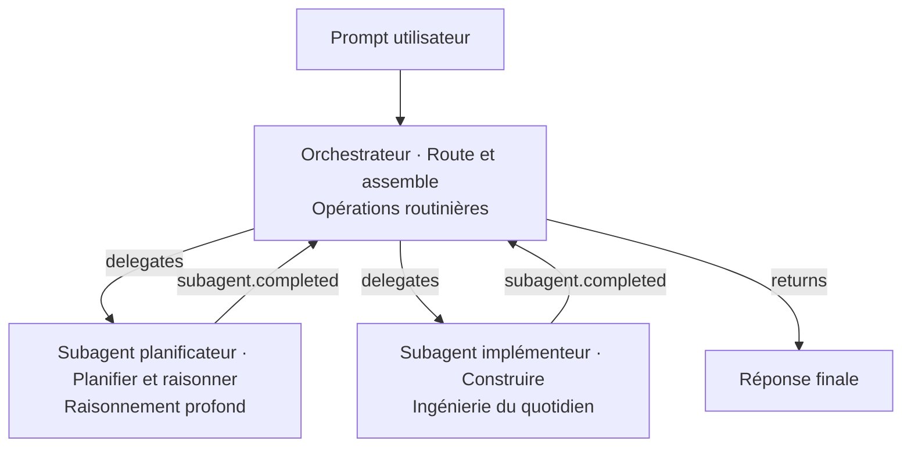

# 317 — Orchestrer des subagents

**Durée** : ~40 min · **Complexité** : ⭐⭐⭐ · **Pré-requis** : [316 — Déplacer le contexte entre modèles](./316-deplacer-contexte-modeles.md), [104 — Agents](../01-fondations/104-agents.md)

> *Laissez un orchestrateur sur un modèle léger déléguer à des subagents spécialisés — un planificateur qui raisonne, un implémenteur qui construit. Chaque subagent tourne dans sa propre fenêtre de contexte, gérée par le runtime — aucun transfert manuel.*

## Objectif

À la fin de ce module, tu sais :

- Concevoir un orchestrateur léger qui route les tâches et assemble les résultats.
- Déléguer à des subagents spécialisés, chacun sur le bon palier de modèle.
- Comprendre l'isolation de contexte : chaque subagent dans sa propre fenêtre.
- Distinguer cette approche du transfert manuel (fork / Markdown du Module 316).

## Ce que tu vas apprendre

1. Le pattern Route & Assemble
2. L'orchestrateur léger et les subagents spécialisés
3. L'isolation de contexte gérée par le runtime
4. Ce qui différencie l'orchestration du transfert manuel

## Contenu pédagogique

Au [Module 316](./316-deplacer-contexte-modeles.md), tu transférais le contexte **à la main** entre deux phases — par fork ou par fichier Markdown. L'orchestration de subagents pousse l'idée plus loin : **un runtime gère le transfert de contexte automatiquement**, et chaque rôle tourne sur le bon palier de modèle sans intervention manuelle.

Le principe : un runtime, le bon modèle par rôle, contexte géré automatiquement.

### Le pattern Route & Assemble

### L'orchestrateur

**Rôle** : Route & assemble — Opérations routinières — Haiku 4.5, Gemini 3 Flash

Un modèle léger délègue chaque tâche au bon subagent et assemble leurs résultats dans la réponse finale — il garde très peu de contexte lui-même.

L'orchestrateur ne raisonne pas en profondeur et n'écrit pas de code : il **route**. C'est exactement pour ça qu'il tourne sur le palier le moins cher.

### Les subagents spécialisés

L'orchestrateur délègue (`delegates`), chaque subagent renvoie son résultat (`subagent.completed`).

#### Subagent planificateur

**Rôle** : Planifier & raisonner — Raisonnement profond — Opus, GPT-5.5

Explore le problème, pèse les compromis et renvoie le plan et l'architecture — la réflexion coûteuse, faite une seule fois.

#### Subagent implémenteur

**Rôle** : Construire — Ingénierie du quotidien — Sonnet 4.6, GPT-5.4, Gemini 3.1 Pro

Prend le plan et écrit le code, ajoute les tests et refactore — l'ingénierie du quotidien, sur un modèle plus léger.

### Le résultat

**Réponse finale.** L'orchestrateur assemble les résultats des subagents et renvoie la réponse finie à l'utilisateur.

*Le contexte de chaque subagent est jeté — seul son résultat subsiste.*

### Le runtime gère le contexte de chaque subagent

> **Le runtime gère le contexte de chaque subagent.** Chaque subagent tourne dans sa propre fenêtre de contexte isolée ; seul son résultat remonte à l'orchestrateur. Pas de changement de modèle en cours de session, pas de *fork* manuel, pas de transfert Markdown.

C'est la différence clé avec le Module 316 :

| | Module 316 — transfert manuel | Module 317 — orchestration |
|---|---|---|
| Transfert de contexte | À la main (fork ou `.md`) | Automatique, par le runtime |
| Choix du modèle par rôle | Toi, à chaque phase | Le runtime, par subagent |
| Isolation de contexte | Une session par phase | Une fenêtre par subagent |
| Effort manuel | Fork / `save → plan.md` | Aucun |

## Exercice

**Énoncé** — En 20 minutes, tu vas modéliser un pipeline orchestrateur → planificateur → implémenteur pour une feature.

**Étapes guidées** :

1. Décris en une phrase la feature à livrer.
2. Écris le rôle de l'orchestrateur : que route-t-il, qu'assemble-t-il ? Quel palier ?
3. Définis le subagent planificateur (palier raisonnement profond) et ce qu'il renvoie.
4. Définis le subagent implémenteur (palier ingénierie du quotidien) et son entrée.
5. Trace le flux `delegates` / `subagent.completed` / `returns` comme dans le schéma.

**Critère de réussite** : ton pipeline assigne le bon palier à chaque rôle et l'orchestrateur ne garde aucun contexte de subagent au-delà de son résultat.

## Validation

Tu peux passer au module suivant si :

- [ ] Tu sais décrire le pattern Route & Assemble avec ses trois rôles.
- [ ] Tu assignes le bon palier de modèle à l'orchestrateur, au planificateur et à l'implémenteur.
- [ ] Tu sais expliquer pourquoi le contexte de chaque subagent est isolé et jeté après usage.
- [ ] Tu sais distinguer l'orchestration automatique du transfert manuel du Module 316.

## Pour aller plus loin

- [Module 208 — Workflows](../02-composition/208-workflows.md) — l'orchestration de sous-agents en composition.
- [Module 211 — Pipeline d'agents](../02-composition/211-pipeline-agents-handbook.md) — une étude de cas complète de coordination multi-subagents.
- [Module 318 — Mesurer & optimiser sa consommation](./318-mesurer-optimiser-consommation.md) — mesurer la consommation réelle d'un pipeline.

## Source

Contenu issu du retour d'expérience d'**Ousmane BARRY**, *MVP Microsoft Foundry* — guide pratique « Développement assisté par IA » ([publication LinkedIn](https://www.linkedin.com/posts/ousmanebarry_depuis-le-1er-juin-on-a-tous-vu-et-senti-ugcPost-7468560023623901184-K69e/)).

**Suivant** : [318 — Mesurer & optimiser sa consommation](./318-mesurer-optimiser-consommation.md)
